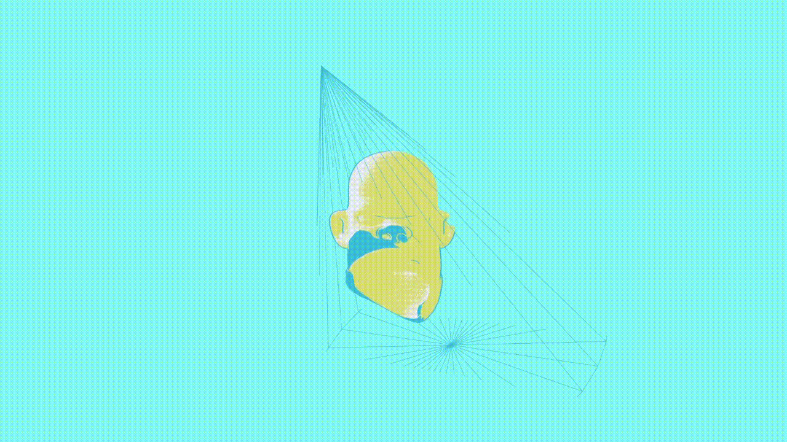

# clipping-head

<div id="top"></div
<div align="center">



  <h3 align="center">Interactive hoverable experience of a floating head. With a native threejs object that clips its head on intersection. Draggable with an elastic spring effect on release. </h3>

</div>

using:

- three
- gasp

## Installation
```
npm install

npm run start
```

## models

- [head](https://sketchfab.com/3d-models/toon-head-freebie-206f5571a5264dfbac6038e6d1928c1a)